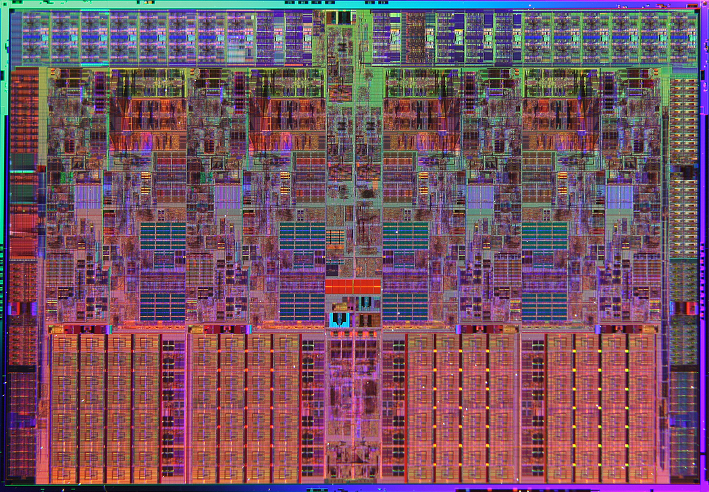

_XXX_ CPU is the first Microprocessor Of Azerbaijan which is developed by Goup.

We are developing this CPU to implement cutting-edge _microarchitectural_ components/techniques (Branch Prediction, RAS, Pipelining, OoO Superscalar execution, Low-Power Techniques, Multi-Threading/SMT).

_The impossible dream_

## Our main goals:
* Analysis power-efficiency, high-bandwidth memory traffic, low cache coherency traffic (mostly Electrical Engineering/Digital Circuit depended things).
* Analysis IEEE articles for implementation.
* Researching about Fabrication process (Silicon IC).
* Implement L1/L2 (Instruction/Data) cache, TLB/ITLB.
* Implement Branch predictor/RAS.
* Implement Pipelining and Superscalar execution (OoO).
* Implement ALU/FPU/AGU/Execution unit.

## SoC
* SPI
* UART

## This is motivation for us.
#### Intel Bloomfield microprocessor
* 263 mm²
* 731,000,000 transistors
* 45 nm process
* 4 cores

